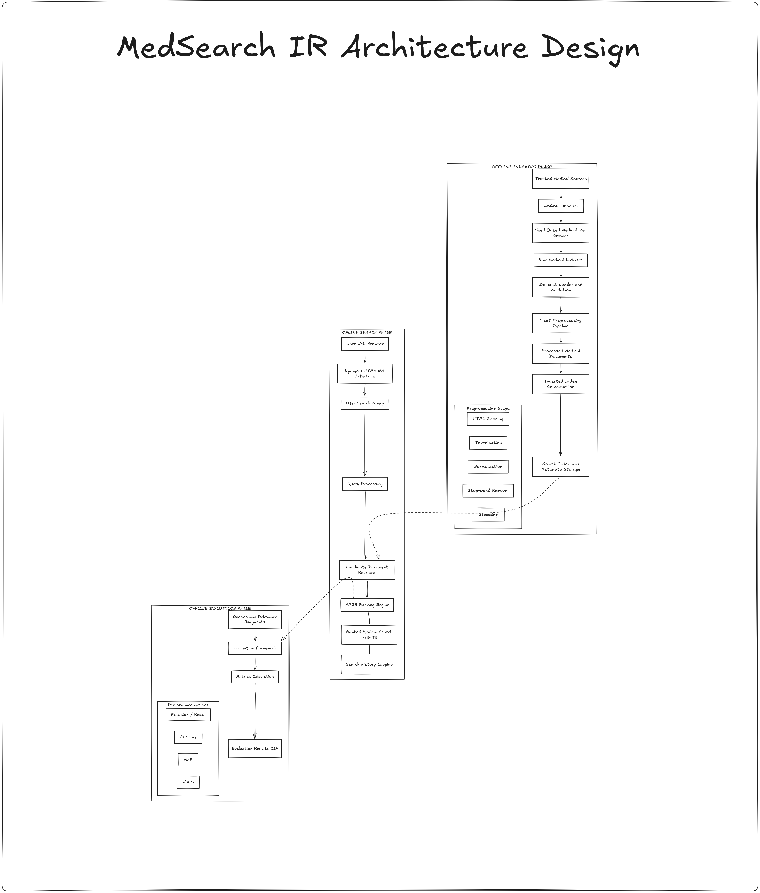
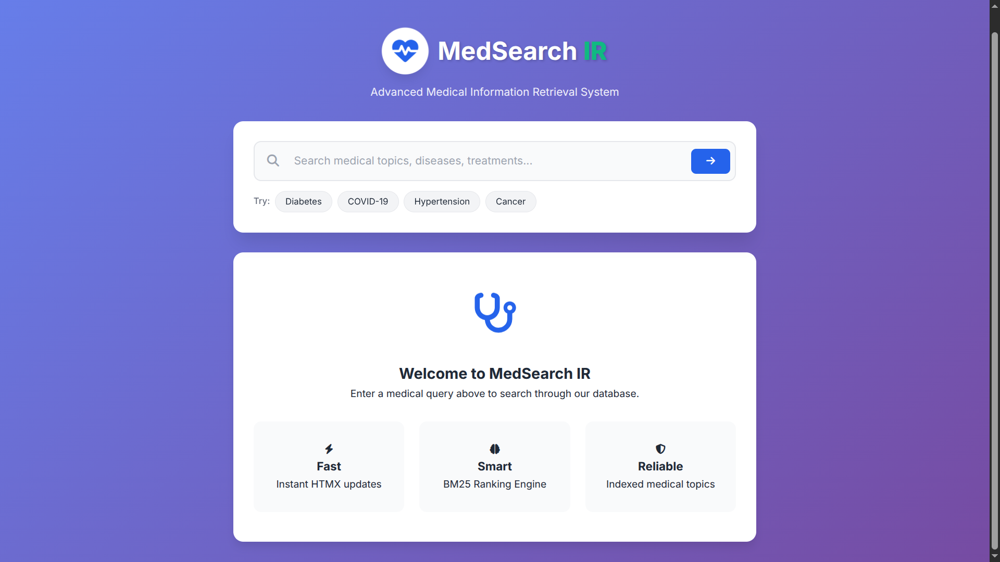
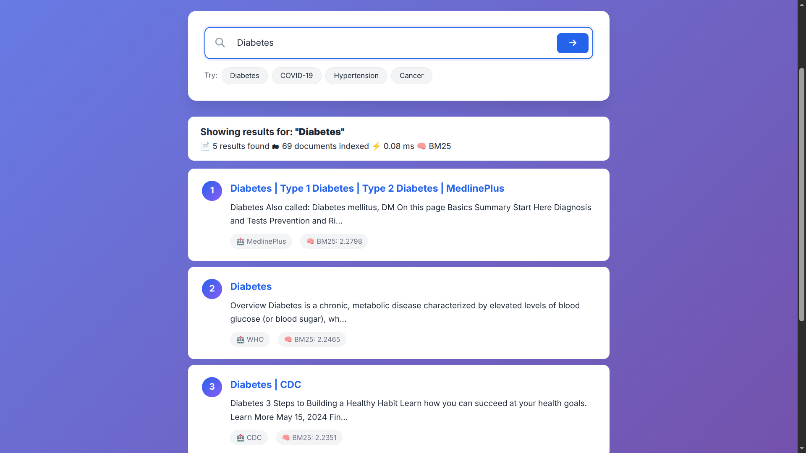
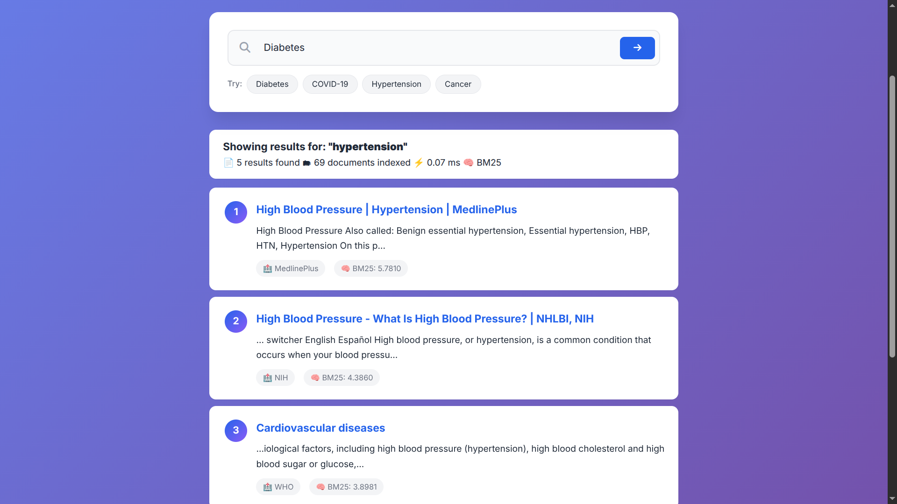

# MedSearch IR
## Medical Information Retrieval System


---

# Overview

MedSearch IR is a medical Information Retrieval system that collects, indexes, ranks, and evaluates healthcare-related documents.

The project demonstrates the complete lifecycle of a classical search engine:

- Document collection
- Dataset construction
- Text preprocessing
- Inverted index generation
- Query processing
- Document ranking
- Retrieval evaluation

The system was developed as part of the Information Retrieval course project.

---

# Problem Statement

The amount of online medical information continues to grow rapidly. However, finding reliable and relevant medical resources can be difficult because traditional keyword searching often produces:

- Too many irrelevant results
- Poor ranking quality
- Difficulty identifying trustworthy resources

MedSearch IR addresses this problem by building a specialized medical search engine that retrieves and ranks documents according to their relevance to user queries.

---

# Objectives

The main objectives of MedSearch IR are:

- Collect medical documents from trusted healthcare organizations
- Build a searchable medical document collection
- Apply classical Information Retrieval techniques
- Implement ranking algorithms
- Evaluate retrieval effectiveness using standard IR metrics

---

# System Architecture

MedSearch IR follows a modular Information Retrieval pipeline.




```

docs/diagrams/system_architecture.png

```

---

# Document Collection

The system uses a seed-based crawling approach.

Instead of embedding URLs directly inside the crawler, medical resources are stored externally:

```

dataset/seeds/medical_urls.txt

```

This allows new sources to be added without modifying the crawler implementation.

Current sources include:

- World Health Organization (WHO)
- Centers for Disease Control and Prevention (CDC)
- National Institutes of Health (NIH)
- National Heart, Lung, and Blood Institute (NHLBI)
- National Institute of Mental Health (NIMH)
- National Institute of Neurological Disorders and Stroke (NINDS)
- National Institute of Diabetes and Digestive and Kidney Diseases (NIDDK)
- MedlinePlus

Current collection:

```

70 medical documents

```

The collected documents are stored as:

```

dataset/raw/medical_articles.csv

```

---

# Text Preprocessing

Medical web pages contain unnecessary information and inconsistent text formats.

The preprocessing pipeline transforms raw documents into searchable text.

Processing steps:

- Text cleaning
- Tokenization
- Normalization
- Stop-word removal
- Stemming

Example:

Before:

```

Diseases, disease, diseased

```

After normalization:

```

diseas

```

Processed documents are stored in:

```

dataset/processed/processed_documents.json

```

---

# Indexing

To support efficient retrieval, MedSearch IR uses an inverted index.

Instead of scanning every document during every search, the index stores the relationship between terms and documents.

Example:

```

heart

|

- DOC0006
    
- DOC0009
    
- DOC0013
    

```

Generated index:

```

dataset/processed/inverted_index.json

```

The index contains:

- Vocabulary terms
- Document references
- Term frequencies

---

# Query Processing

When a user submits a query:

Example:

```

symptoms of diabetes

```

The system:

1. Cleans the query
2. Tokenizes terms
3. Matches terms with the inverted index
4. Retrieves candidate documents
5. Calculates ranking scores

---

# Ranking Algorithm

MedSearch IR implements two classical Information Retrieval ranking approaches:

## TF-IDF

TF-IDF is used as a baseline ranking method.

The score is calculated using:

- Term Frequency (TF)
- Inverse Document Frequency (IDF)

TF-IDF gives higher importance to terms that frequently appear in a document but are uncommon across the entire collection.

---

## BM25

BM25 is the primary ranking algorithm used by MedSearch IR.

Unlike simple TF-IDF scoring, BM25 improves retrieval effectiveness by considering:

- Term frequency saturation
- Document length normalization
- Inverse document frequency weighting

The implementation uses standard BM25 parameters:

```
k1 = 1.5  
b = 0.75
```

The final relevance score combines term importance and document characteristics.

Additional filtering is applied using:

- Minimum BM25 score threshold
- Query term coverage threshold

to reduce weak document matches.

---

# Search Example

Example query:

```

heart disease

```

Possible results:

```

1. Heart Disease | CDC
    
2. Coronary Heart Disease | NHLBI
    
3. Heart Disease | MedlinePlus
    

```

Documents with stronger relevance receive higher BM25 scores and appear earlier in results.

---

# Evaluation

The system includes an offline evaluation framework using manually created query relevance judgments.

Evaluation dataset:

```

dataset/qrels/

````

Contains:

- Search queries
- Relevant document mappings

Implemented metrics:

| Metric | Purpose |
|-|-|
| Precision | Measures correctness of retrieved documents |
| Recall | Measures coverage of relevant documents |
| F1 Score | Balance between precision and recall |
| MAP | Measures ranking effectiveness |
| nDCG | Measures ranked result quality |

Evaluation command:

```bash
python scripts/evaluate.py
````

Output:

```
results/evaluation_results.csv
```

---

# Evaluation Results

Example evaluation results:

|Query|Precision|Recall|MAP|nDCG|
|---|---|---|---|---|
|symptoms of diabetes|0.60|1.00|0.92|0.97|
|heart disease causes|0.80|1.00|1.00|1.00|
|cancer risk factors|0.60|1.00|1.00|1.00|
|asthma management|0.40|1.00|1.00|1.00|

The results demonstrate that the system successfully retrieves relevant medical documents for most evaluation queries.

---

# A/B Testing

The project includes an offline comparison between:

```
System A:
TF-IDF Ranking


System B:
BM25 Ranking
```

Evaluation metric:

```
Mean Average Precision (MAP)
```

Results:

```
results/ab_test_results.csv
```

This allows future experiments with alternative ranking algorithms.

---

# Project Structure

```
MedSearch_IR

├── config
│
├── dataset
│   ├── seeds
│   ├── raw
│   ├── processed
│   └── qrels
│
├── docs
│   ├── diagrams
│   └── report_notes
│
├── scripts
│   ├── crawl.py
│   ├── load_dataset.py
│   ├── preprocess.py
│   ├── build_index.py
│   └── evaluate.py
│
├── src
│   ├── collection
│   ├── preprocessing
│   ├── indexing
│   ├── query
│   ├── ranking
│   ├── evaluation
│   └── utils
│
├── tests
│
└── README.md
```

---

# Installation

Clone repository:

```bash
git clone https://github.com/amm926616/MedSearch_IR.git

cd MedSearch_IR
```

Create virtual environment:

```bash
python -m venv .venv
```

Activate:

Linux:

```bash
source .venv/bin/activate
```

Install dependencies:

```bash
pip install -r requirements.txt
```

---

# Running the System

MedSearch IR can be executed in two modes:

1. Command-line Information Retrieval System
2. Django Web Search Interface

---

## 1. Command-line IR System

Run the complete pipeline:

### 1. Crawl medical documents

```bash
python scripts/crawl.py
````

### 2. Load dataset

```bash
python scripts/load_dataset.py
```

### 3. Preprocess documents

```bash
python scripts/preprocess.py
```

### 4. Build search index

```bash
python scripts/build_index.py
```

### 5. Run evaluation

```bash
python scripts/evaluate.py
```

### 6. Start command-line search engine

```bash
python main.py
```

Example:

```
Medical Search > diabetes
```

The system returns ranked documents using BM25 scoring.

---

# 2. Django Web Interface

MedSearch IR also provides a web-based search interface built with:

- Django
    
- HTMX
    
- HTML/CSS
    
- Local static assets
    

The web application provides:

- Real-time search updates
    
- BM25 ranked results
    
- Search statistics
    
- Document sources
    
- Relevance scores
    

---

## Web Application Setup

Navigate to the web directory:

```bash
cd web
```

Apply Django database migrations:

```bash
python manage.py migrate
```

---

## Start the Development Server

Run:

```bash
python manage.py runserver
```

The server starts at:

```
http://127.0.0.1:8000/
```

Open the URL in a browser.

---

## Example Search

Enter a medical query:

```
renal stone
```

Example output:

```
Showing results for "renal stone"

1 result found
48 documents indexed
BM25 ranking
Processing time: 20 ms


1

Kidney Diseases | Renal Disease | MedlinePlus

Source:
MedlinePlus

BM25 Score:
12.4300
```

---

## Web Application Structure

```
web/

├── manage.py
│
├── medsearch
│   ├── settings.py
│   └── urls.py
│
├── search
│   ├── views.py
│   └── urls.py
│
├── templates
│   └── search
│       ├── search.html
│       └── partials
│           └── results.html
│
└── static
    ├── css
    │   └── styles.css
    │
    ├── js
    │   └── htmx.min.js
    │
    └── favicon.svg
```

---

## Stopping the Server

Press:

```bash
CTRL + C
```

# Technologies Used

|Technology|Purpose|
|-|-|
|Python|Core IR implementation|
|NLTK|Text preprocessing and tokenization|
|Django|Web application framework|
|HTMX|Dynamic search interface|
|HTML/CSS|Frontend presentation|
|JSON|Intermediate index storage|
|CSV|Dataset storage|
|Git|Version control|

---

# Limitations

Current limitations:

- Small document collection
    
- Limited query diversity
    
- No semantic understanding
    
- No user feedback signals
    
- No learning-to-rank model
    

---

# Future Improvements

Possible future improvements include:

## Larger Medical Corpus

Integrate:

- PubMed
    
- Europe PMC
    
- Medical guideline databases
    

## Semantic Search

Add:

- Word embeddings
    
- Transformer models
    
- Vector databases
    

## Learning-to-Rank

Use:

- Click feedback
    
- User interaction data
    
- Machine learning ranking models
    

## Personalization

Support:

- User preferences
    
- Search history
    
- Medical specialty filtering
    

---

# Web Interface Preview

The Django frontend provides an interactive medical search experience.

Features:

- Medical query search
- BM25 ranking
- Document snippets
- Source attribution
- Search performance statistics

Screenshots:







---

# Authors

MedSearch IR Project Team

Information Retrieval Course

---

# License

Academic project for educational purposes.

---
